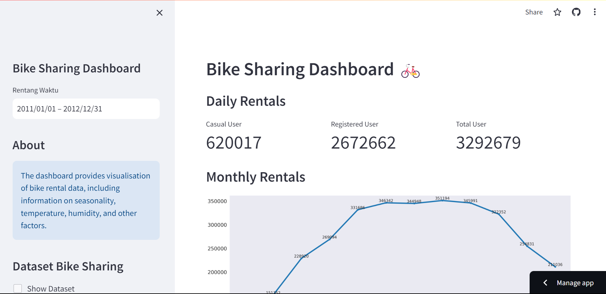

# Belajar Analisis Data dengan Python

## Dataset: Bike Sharing 
[Bke Sharing Dataset](https://www.kaggle.com/datasets/lakshmi25npathi/bike-sharing-dataset)

## Streamlit Cloud:
[Streamlit Cloud](https://satyamahinsa-bike-sharing-project-dashboard-bike-sharing-cuwtyj.streamlit.app/)



## Setup Environment
- Install Visual Studio Code for Text Editor
- Execute the command below on command line 
    ```
    pip install pandas matplotlib seaborn streamlit
    ```

## Project Installation & Run Streamlit
The steps to install project and run dashboard is as follows:

1. Clone this repository
    ```
    git clone https://github.com/satyamahinsa/bike-sharing-project.git
    ```

2. Move to directory bike_sharing-project/
    ```
    cd bike_sharing-project
    ```

3. Run streamlit app
    ```
    streamlit run dashboard-bike-sharing.py
    ```

4. Stop the application program by `Ctrl + c`.
